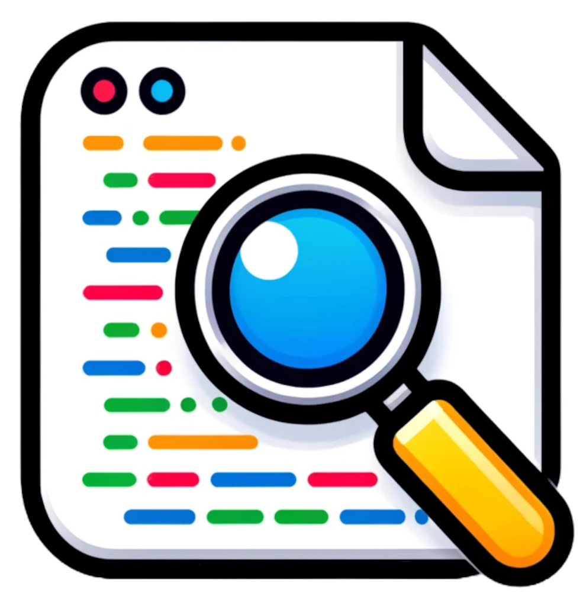

   
  
   
  <h2 align="center">Smart Contract Inspector</h2>
  
<strong>One click (or keyboard shortcut) to Inspect the source code of a Smart Contract with your preferred Web IDE</strong>

  
When you are in the detail page of a smart contract on one of the supported Etherscan domains, just click the Smart Contract Inspector icon or hit the <code>Cmd+Dot</code> keyboard shortcut to review the source code in your preferred Web IDE

## Motivation

I wasted too much important time clicking in the Etherscan interface to just quickly open one instance of Web IDE to properly review the smart contract codebase.

I wanted an easy and quick solution to open it with just a keyboard shortcuts, something like you can do inside a GitHub repository.

## Supported Web IDE

- [DethCode](https://github.com/dethcrypto/dethcode)
- More to come

## Supported Block Explorer websites and blockchains

- [etherscan.io](https://etherscan.io/) + [etherscan.com](https://etherscan.com/) (Ethereum Mainnet)
- [goerli.etherscan.io](https://goerli.etherscan.io/) (Ethereum Goerli Testnet)
- [bscscan.com](https://bscscan.com/) (Binance Smart Chain)
- [testnet.bscscan.com](https://testnet.bscscan.com/) (Binance Smart Chain Testnet)
- [ftmscan.com](https://ftmscan.com/) (Fantom Testnet)
- [testnet.ftmscan.com](https://testnet.ftmscan.com/) (Fantom Testnet)
- [optimistic.etherscan.io](https://optimistic.etherscan.io/) (Optimism)
- [polygonscan.com](https://polygonscan.com/) (Polygon)
- [mumbai.polygonscan.com](https://mumbai.polygonscan.com/) (Polygon Mumbai Testnet)
- [arbiscan.io](https://arbiscan.io/) (Arbitrum)
- [snowtrace.io](https://snowtrace.io/) (Avalance)
- [testnet.snowtrace.io](https://testnet.snowtrace.io/) (Avalance Fuji Testnet)
- [cronoscan.com](https://cronoscan.com/) (Cronos Mainnet)
- [basescan.org](https://basescan.org/) (Base)
- [sepolia.basescan.org](https://sepolia.basescan.org/) (Base Sepolia Testnet)
- [fraxscan.com](https://fraxscan.com/) (Fraxtal)
- [holesky.fraxscan.com](https://holesky.fraxscan.com/) (Fraxtal Holesky Testnet)

## Disclosures

- Smart Contract Inspector is not affiliated to [DethCode](https://github.com/dethcrypto/dethcode) and their developers
- Smart Contract Inspector is not affiliated to the [Etherscan](https://etherscan.io) platform end their developers
- Smart Contract Inspector is based on the [Chrome Extension TypeScript Starter](https://github.com/chibat/chrome-extension-typescript-starter) template

## Contributing and development

See the [CONTRIBUTING](CONTRIBUTING.md) guidelines.

## Social

Visit my website [https://stermi.xyz](https://stermi.xyz/)
Follow me on [Twitter](https://twitter.com/StErMi).
